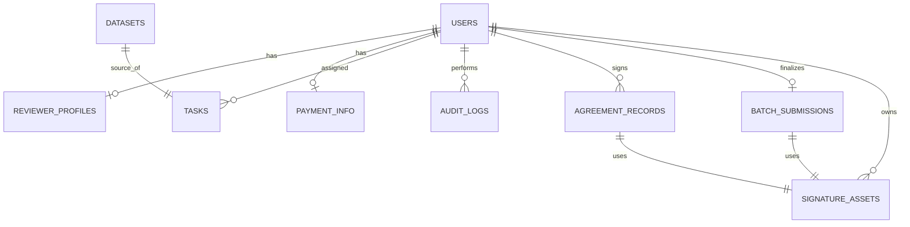
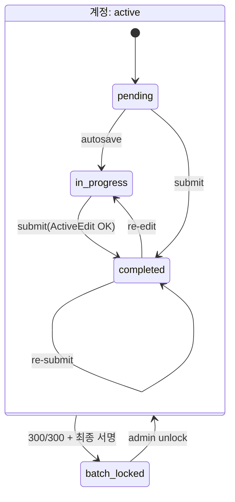

# Survey Web — 통합 기획/개발 설계서 v6.0
### 로그인 → 동의·서명 → Q-A 검수 → 최종 제출·락킹, 전 과정

> PRD + Technical Spec(구현 착수용). 이전 v2~v5와 워크스페이스 UX 문서를 통합·대체한다.
> 핵심은 **7명이 각 300문항을 검수하며 정답을 변형(Active Edit)하고 실시간 검증받는 워크스페이스**이며,
> 인증·동의·**듀얼 서명**·최종 락킹은 이를 감싸는 절차다.

---

## 0. 문서 정보 & 설계 판단

| 항목 | 내용 |
|---|---|
| 규모 | 검수자 7명, Q-A 2,100건(검수자당 300건), 동시 접속 ≤ 8 → **소규모 내부 도구**. 단일 인스턴스로 충분 |
| 우선순위 | 검수 UX·편집 품질 · 법적 증빙(동의/저작권/서명) > 고트래픽 최적화 |

### 0.1 용어
Reviewer/Admin(검수자/관리자) · **Active Edit**(정답을 유의미하게 변형해야 제출 통과; 저작권 귀속) · Task((검수자×원본문항) 작업 레코드) · **듀얼 서명**(한글 타이핑+마우스 드로잉) · **락킹**(300문항 완료 후 최종 서명 제출 → 계정 읽기전용 확정) · 증빙물(서약 전문+서명+시각+IP 합성 PDF).

### 0.2 내가 판단해 보정·추가한 사항 — *우리 상황 해석 → 결정*
| # | 상황 해석 | 결정 |
|---|---|---|
| **D1** | 서명은 법적 증빙물, `users`는 핫 테이블 | 서명 이미지 인라인 저장 폐기 → **`signature_assets`(파일+sha256) + 증빙 테이블 참조** 분리 |
| **D2** | "서명함" 기준 모호 → 빈 제출 우려 | 서명 = **타이핑 성명(비공백) + 캔버스(비어있지 않음) 둘 다 필수**, 공백/빈 캔버스 검출 |
| **D3** | 서명 이미지 단독은 증빙 약함 | **서명 시점 서약 전문+서명+시각+IP 합성 PDF 서버 렌더·해시** → 관리자 다운로드와 동일 증빙물 |
| **D4** | 최종 제출은 비가역이나 정정 필요 가능 | **300 completed 원자 검증 → 잠금**, 이후 편집 API `423`, 잠금 전만 재수정, **관리자 unlock(감사)** |
| **D5** | 실시간 알림의 실명 노출이 가명화와 충돌 | 로그·SSE엔 **가명만**, **관리자 화면에서만** 권한 기반 실명 *표시 시점* 해석(로그 미기록) |
| **D6** | 손글씨 폰트 라이선스 리스크 | **오픈 라이선스(나눔손글씨 펜/나눔명조, SIL OFL)** |
| **D7** | 서명/잠금 전용 에러 의미 필요 | `SIGNATURE_REQUIRED`/`INCOMPLETE_TASKS`/`BATCH_LOCKED` 추가 |
| **D8** | 숫자 300칸 그리드는 *내용*이 안 보여 비효율 | **네비게이션을 마스터-디테일 Q-A 목록으로 변경**(질문 미리보기·상태·**검색**·필터·정렬). 숫자 그리드 폐기 |
| **D9** | 300회 새로 작성은 마찰 폭증 | **정답 필드는 원본 복사로 시작(제자리 편집)**, 단 **검증 기준선은 항상 원본**(재수정 포함) |
| **D10** | "1단어"는 저작권엔 약함 | **품질 티어(none/trivial/ok/good)** + 변경률 가이드. trivial은 **차단 대신 관리자 플래그** |
| **D11** | 실시간 반응성 vs 위변조 방지 | **검증은 클라 로컬 즉시(지연 0) + 서버 제출 시 권위 재검증** |
| **D12** | 자동 진행 vs 자유 이동 | 제출 시 **다음 pending 자동 로드** + 목록에서 **임의 항목 점프** 공존 |

---

## 1. 개요·범위·역할

**목적** — 2,100건 Q-A를 7명이 분담 검수. 정답 능동 변형을 강제해 산출물의 지식재산권을 주최 측에 귀속시키고, 동의·저작권 이관을 듀얼 서명으로 증빙하며, 전 과정을 불변 로그로 남긴다.

**범위(In)** — 로그인/세션, 동의·서명 게이트, **검수 워크스페이스(목록↔상세, 정답 변형, 실시간 검증, 사유 태깅, 재수정)**, 자동 저장, 최종 제출·락킹(서명), 관리자(업로드/할당/실시간 모니터링/서명·PDF 증빙/Export), PII 생명주기.
**범위(Out)** — 교차/이중 검수, 자동 채점, 다국어, 모바일 전용 앱, SSO(부록 D).

**역할(RBAC)**
| 역할 | 권한 |
|---|---|
| `reviewer` | 본인 Task 조회/임시저장/제출/재수정, 동의·서명, 최종 제출, 본인 진행률 |
| `admin` | 업로드·할당, 전체 모니터링(SSE), 서명·PDF 열람, 잠금 해제, Export, 검수자/PII 관리·파기, 감사 로그 |

---

## 2. 비즈니스 규칙 (BR)

| ID | 규칙 |
|---|---|
| **BR-1** | 제출 통과 조건 = **정답(Answer)** 의 유의미한 변형(저작권). |
| **BR-2** | 통과 기준 = 정규화 후 *단어 단위 변경 ≥ `MIN_WORD_CHANGES`(기본 1)*. 공백·문장부호만 추가는 불인정. |
| **BR-3** | 질문 수정은 선택. 문제 발견 시에만 사유 태깅 후 선택적 수정. |
| **BR-4** | 사유 태깅은 정답 변형과 독립. `이상없음`이어도 BR-1 면제 안 됨. |
| **BR-5** | `completed`도 **잠금(BR-12) 전이면** 재편집·재제출(overwrite + 신규 감사 로그). |
| **BR-6** | 동의/보안서약 최초 1회. 이후 게이트 스킵. 동의 시 **듀얼 서명 + 증빙(PDF/해시/IP/시각)** 저장. |
| **BR-7** | 임시 저장(draft)은 검증 없이 저장. 검증은 최종 제출에서만. |
| **BR-8** | 단일 활성 세션. 새 로그인 시 기존 세션 무효화. |
| **BR-9** | 제출 시 `원본→수정` diff·변경통계·행위자·IP·시각을 불변 로그로 보존. |
| **BR-10** | 지급용(전화·계좌)은 검수비 지급 후 즉시 파기, 성명은 DB/Export에서 가명화. |
| **BR-11** | 보안서약·최종 제출 두 시점에서 **듀얼 서명** → 증빙물 생성. |
| **BR-12** | 300문항 모두 `completed` → 최종 서명 제출 → **계정 전체 읽기전용 잠금**. 이후 편집 API `423`. 관리자만 unlock. |

> 정정: `이상없음 && 변경없음 → 통과` 분기는 폐기. 정답 변형은 사유와 무관하게 항상 필수(BR-1·BR-4).

---

## 3. 전체 사용자 여정 (End-to-End)

```mermaid
flowchart TD
  LOGIN[로그인] --> ME{me: is_agreed?}
  ME -- false --> AGR[동의 게이트 + 듀얼 서명]
  AGR --> WS
  ME -- true(잠금?) --> LOCKED{is_batch_submitted?}
  LOCKED -- true --> ROWS[워크스페이스: 읽기전용]
  LOCKED -- false --> WS[워크스페이스: 목록↔상세]
  WS --> ITEM[항목 클릭 → 상세 로드]
  ITEM --> EDIT[정답 변형 + (선택)질문/사유]
  EDIT --> RT{실시간 검증<br/>변경 ≥ 1?}
  RT -- 미달 --> EDIT
  RT -- 충족 --> SUB[제출 ⌃⏎ → 다음 pending]
  SUB --> WS
  WS --> DONE{300/300?}
  DONE -- yes --> FINAL[최종 제출 + 듀얼 서명]
  FINAL --> LOCK[락킹: 읽기전용]
  ADMIN[관리자: 실시간 모니터링·서명/PDF·Export] -. SSE .- SUB
  ADMIN -. SSE .- FINAL
```

---

## 4. 아키텍처

### 4.1 구성도
```
Browser(Next.js) ──HTTPS──▶ Nginx ──▶ FastAPI ──asyncpg──▶ PostgreSQL(+pgcrypto)
       ▲ SSE(admin live)                 └─▶ 파일 저장소(서명 PNG·증빙 PDF)
```
- 실시간은 단방향 푸시뿐 → **SSE**(7명 규모, WebSocket보다 단순). 다중 인스턴스 시 Redis Pub/Sub.
- 서명·PDF는 **파일 저장소**(로컬 볼륨/S3 호환), DB는 참조만(D1).

### 4.2 스택 & 핵심 라이브러리
**Frontend** (Next.js 14 App Router, TS)
상태 `zustand` · 서버상태 `@tanstack/react-query` · HTTP `axios` · UI `tailwindcss`+`shadcn/ui` · 아이콘 `lucide-react` · 셀렉트 `react-select` · 토스트 `react-hot-toast` · 디바운스 `use-debounce` · Diff 표시 `diff-match-patch`/`react-diff-viewer-continued` · **서명 `react-signature-canvas`** · 손글씨 폰트 **Nanum Pen Script/나눔명조(SIL OFL, `next/font`)** · (선택)목록 가상화 `react-window`.

**Backend** (FastAPI, Python 3.11)
ORM `SQLAlchemy 2.x`(async) · 마이그레이션 `alembic` · 드라이버 `asyncpg` · 엑셀 `pandas`+`openpyxl` · 검증 `pydantic v2` · 인증 `pyjwt`,`passlib[bcrypt]` · SSE `sse-starlette` · 암호화 `cryptography`(Fernet)/`pgcrypto` · 이미지 `Pillow` · **증빙 PDF `weasyprint`**(대안 Playwright) · (선택)토큰 정밀화 `kiwipiepy`.

**Infra**: Docker/compose · Nginx(TLS) · PostgreSQL 16 · (운영 AWS EC2+RDS+S3).

### 4.3 리포지토리 구조
```
survey-web/
├─ docker-compose.yml · .env.example
├─ backend/app/{main.py, core/{config,security,crypto}.py, db/{base,models}.py,
│   schemas/, api/{deps,auth,tasks,admin}.py,
│   services/{active_edit,assignment,signature,pdf,export,events,storage}.py, alembic/}
└─ frontend/app/{login,agreement,workspace,admin}/page.tsx · middleware.ts
   components/{QAList,QAListItem,DetailEditor,AnswerEditor,ValidationBar,InlineDiff,
              ReasonChips,SignaturePad,FinalSubmitModal,LockedBanner,admin/*}
   stores/{authStore,taskStore}.ts · lib/{api,activeEdit,hooks}.ts
```

### 4.4 환경 변수(발췌)
```env
DATABASE_URL=postgresql+asyncpg://survey:pass@db:5432/surveydb
JWT_SECRET=… · JWT_ACCESS_TTL_MIN=120 · JWT_REFRESH_TTL_DAYS=7
PII_FERNET_KEY=base64-32byte · SIGNATURE_STORAGE=/data/signatures · AGREEMENT_VERSION=2026-06-19.v1
MIN_WORD_CHANGES=1 · MIN_CHANGE_RATIO=0.0 · SUSPICIOUS_RATIO=0.05 · GOOD_RATIO=0.30 · SIGN_MIN_INK_RATIO=0.002
NEXT_PUBLIC_API_BASE=https://survey.example.com/api/v1
```

---

## 5. 데이터 모델

### 5.1 ERD


### 5.2 테이블
**users** `id`(UUID PK) · `username`(UNIQUE) · `password_hash` · `role`(admin/reviewer) · `is_agreed`(bool) · `reviewer_code`(가명 UNIQUE) · `session_version`(int) · **`is_batch_submitted`**(bool) · **`batch_submitted_at`**(ts).
**reviewer_profiles** `user_id`(PK,FK) · `real_name_enc`(BYTEA) · `branch`(공/육/해/해병) · `rank` · `specialty` · `degree` · `email`.
**payment_info** `user_id`(PK,FK) · `phone_enc`·`bank_name_enc`·`bank_account_enc`(BYTEA) · `purged`(bool) · `purged_at`.
**datasets**(Immutable) `id`(PK) · `original_q`·`original_a`(TEXT) · `assigned_persona`(NULL) · `batch_id`(Idx).
**tasks** `id`(UUID PK) · `user_id`(FK,Idx) · `dataset_id`(FK,Idx) · `status`(pending/in_progress/completed,Idx) · `draft_q`·`draft_a` · `modified_q`·`modified_a` · `error_reasons`(JSONB) · `error_note` · `version`(int,낙관적잠금) · `last_accessed_at` · `submitted_at` · **UNIQUE(user_id,dataset_id)**.
**signature_assets**(Immutable) `id`(PK) · `user_id`(FK) · `kind`(agreement/batch) · `storage_key` · `sha256` · `mime` · `created_at`.
**agreement_records** `id`(PK) · `user_id`(FK) · `agreement_version` · `text_sha256` · `checkbox_states`(JSONB) · `typed_name` · `signature_asset_id`(FK) · `pledge_pdf_key` · `client_ip` · `agreed_at`.
**batch_submissions** `id`(PK) · `user_id`(FK,UNIQUE) · `typed_name` · `signature_asset_id`(FK) · `final_pdf_key` · `completed_count` · `client_ip` · `submitted_at`(=정산 기준).
**audit_logs**(Immutable) `id`(BIGINT PK) · `user_id`(FK) · `action_type`(LOGIN/AGREE_SIGN/AUTOSAVE/SUBMIT/BATCH_SUBMIT/BATCH_UNLOCK/PII_PURGE) · `details`(JSONB) · `client_ip` · `created_at`.

> 무결성: `datasets`·`audit_logs`·`signature_assets`·증빙 테이블은 앱 DB 롤 **UPDATE/DELETE 미부여**(append-only).
> `error_reasons` 태그: `문맥_어색`·`오타`·`사실관계_오류`·`전문용어_오용`·`중복`·`기타`·`이상없음`(배타).

### 5.3 상태 전이 (Task + 계정 잠금)


---

## 6. 인증·세션·동의(서명)

- **토큰**: Access JWT(120m)+Refresh(7d), 둘 다 `httpOnly·Secure·SameSite`. payload `{sub,role,sv}`. 변경요청 CSRF.
- **라우팅 가드**(미들웨어): `/auth/me`로 `{role,is_agreed,is_batch_submitted}` 확인 → 미인증 `/login`, `!is_agreed` `/agreement`, `is_batch_submitted` 워크스페이스 읽기전용, 그 외 워크스페이스(마지막 항목 auto-resume).
- **단일 세션**(BR-8): 로그인 시 `session_version++`→JWT `sv` 반영, 의존성에서 일치 확인. 불일치 시 `401 SESSION_SUPERSEDED`.
- **동의 게이트**(BR-6): `/agreement` 전체화면(닫기 불가). Part1 보안서약·저작권 / Part2 개인정보 / Part3 세무(주민번호 유선·미저장) 각 체크 + 하단 스크롤 + **듀얼 서명** → `POST /auth/agreement` → 서명 검증·증빙 PDF 생성 → `agreement_records` → `is_agreed=true` → `audit(AGREE_SIGN)`.

---

## 7. 검수 워크스페이스 — 핵심 (목록 ↔ 상세)

### 7.1 레이아웃 (와이어프레임)
```
┌──────────────────────────┬───────────────────────────────────────────────┐
│ 진행 1/8 · [검색____]      │  #003 [대기]                  검증 기준: 원본 정답 │
│ [전체][대기][작업중][완료]  │  ┌ 원본(읽기전용) ─────────────────────────────┐ │
│ ───────── Q-A 목록 ─────── │  │ Q  PPBEES 다섯 단계를 순서대로 쓰시오.        │ │
│ ● #001 한국형 3축 체계를… ✎│  │ A  기획, 계획, 예산, 집행, 분석평가 순입니다.  │ │
│ ◐ #002 전략사령부는 언제…  │  └─────────────────────────────────────────────┘ │
│ ○ #003 PPBEES 다섯 단계…◀ │  질문 수정(선택) [____________________________]   │
│ ○ #004 다영역작전(MDO)이… │  정답 수정(필수) [============================]   │ ← 원본 복사로 시작
│ ○ #005 DOTMLPF-P에서…     │  변경 단어 3 · 변경률 14% ✓     [diff 보기 ▢]     │ ← 실시간 검증
│  …(스크롤, 실제 300개)     │  문제 있나요?(선택) [오타][문맥][사실관계][용어]   │
│ ○ 대기 ◐ 작업중 ● 완료 ✎수정│  [원본으로] [임시저장]        [제출 & 다음 ⌃⏎]   │
└──────────────────────────┴───────────────────────────────────────────────┘
```
- **숫자 그리드 폐기(D8)** → 왼쪽은 **내용이 보이는 Q-A 목록**. 클릭 → 오른쪽 상세.

### 7.2 사이드바 — Q-A 목록(master)
- 행 구성: **상태 점**(○대기/◐작업중/●완료) + `#번호` + **질문 미리보기(2줄 말줄임)** + 수정됨(✎) 표시. 선택 행 강조(좌측 액센트+배경).
- 상단: **진행률**(`1 / 300 완료`) · **검색**(질문/정답 본문 텍스트 검색 — 300개 탐색 핵심) · **필터칩**(전체/대기/작업중/완료) · (선택)정렬(번호순/상태순/최근수정).
- 300개는 가상화(`react-window`) 권장(필수 아님). 키보드 `↑/↓`로 행 이동, `Enter`로 상세 로드.

### 7.3 상세 — 에디터(detail)
- 헤더: `#번호` + 상태 배지 + "검증 기준: 원본 정답" 표기.
- **원본 카드(읽기전용)**: Q/A. `user-select:none`(복사 억제 — 완전 차단 아님).
- **수정 영역**: 질문(작게, 선택) + **정답(크게, 기본 포커스)**. 정답은 **원본 복사로 시작**(D9).
- **실시간 검증 바**: 변경 단어/변경률/티어 + diff 토글.
- **오류 사유 칩**(멀티, 대상 토글) + 메모(선택).
- **액션 바**: `원본으로` / `임시저장` / `제출 & 다음(⌃⏎)`.

### 7.4 정답 변형(Active Edit) 설계
- **프리필 결정(D9)**: 빈 칸 새작성(품질↑·마찰↑) vs **원본 복사 제자리 편집(채택)**. 300회 마찰을 고려해 후자 + 실시간 가이드 + 관리자 품질 플래그로 보완.
- **검증 기준선 = 항상 원본**: `draft_answer` vs **`original_a`**. 재수정 시 에디터엔 `modified_a`를 불러오되 기준선은 원본 유지 → 재수정 후에도 "원본 대비 변형" 보장. 원본과 같아지면 제출 재비활성.
- **품질 티어(D10)**: `none`(변경0/동일/공백만, 제출❌) · `trivial`(변경≥1·변경률<5%, 제출✅+의심 플래그) · `ok`(5–30%) · `good`(≥30%). trivial은 **차단하지 않고** `suspicious=true`로 관리자 검토 대상에만 올린다(정직한 짧은 정답 보호). 임계값은 설정값, 표본으로 보정.
- **저작권 메모**: "1단어"는 기술적 하한일 뿐, 충분한 패러프레이즈가 2차적 저작물 창작성에 유리(법적 충분성은 법무 확인). UI가 변경률로 더 많은 변형을 *유도*.

### 7.5 실시간 검증
- **아키텍처(D11)**: 카운터·버튼·티어·인라인 diff = **클라 로컬 즉시 계산**(키 입력마다, 서버 왕복 0). 서버는 ① autosave(검증X, 디바운스 1.5s) ② **제출 시 권위 검증**(`verify_active_edit` 재수행 + 감사 로그). 클라/서버 동일 규칙 공유.
- **상태 머신**: Untouched → (공백만)Trivial / (편집)Valid → Trivial(<5%)·Good(≥30%) / (전체삭제)Empty → 제출 → completed.
- **UI 카피(그대로 사용)**:
  - Untouched `정답을 수정해 주세요. (최소 1단어 이상 변경)`
  - 공백/기호만 `공백·문장부호만으로는 변경이 인정되지 않아요.`
  - Empty `정답이 비어 있어요.`
  - trivial `변경 단어 {n} · 변경률 {r}% · 검토 대상`
  - ok `변경 단어 {n} · 변경률 {r}% ✓`
  - good `좋은 패러프레이즈예요 ✓ (변경률 {r}%)`
  - 제출 비활성 툴팁 `정답을 1단어 이상 수정하면 제출할 수 있어요.`
- **클라이언트 미러** `lib/activeEdit.ts` (서버 `verify_active_edit`의 미러; §13.1):
```ts
const norm = (t:string)=> (t??"").normalize("NFKC").trim().replace(/\s+/g," ");
const tok = (t:string)=> norm(t).replace(/[^\p{L}\p{N}\s]/gu," ").split(/\s+/).filter(Boolean);
function changedWords(o:string,m:string){const a=tok(o),b=tok(m),n=a.length,M=b.length;
  const dp=Array.from({length:n+1},()=>new Int32Array(M+1));
  for(let i=1;i<=n;i++)for(let j=1;j<=M;j++)dp[i][j]=a[i-1]===b[j-1]?dp[i-1][j-1]+1:Math.max(dp[i-1][j],dp[i][j-1]);
  const lcs=dp[n][M];return{changed:(n-lcs)+(M-lcs),ratio:n?((n-lcs)+(M-lcs))/n:0,modLen:M};}
export function evaluateEdit(orig:string,draft:string,{minWords=1,suspicious=0.05,good=0.30}={}){
  const {changed,ratio,modLen}=changedWords(orig,draft);
  const identical=norm(orig)===norm(draft), empty=modLen===0, valid=!identical&&!empty&&changed>=minWords;
  let tier:"none"|"trivial"|"ok"|"good"="none";
  if(valid) tier= ratio>=good?"good":ratio<suspicious?"trivial":"ok";
  return {valid,changed,ratio,tier,empty};
}
```

### 7.6 인터랙션 (키보드/자동이동/저장)
- **키보드 우선**: `⌃⏎` 제출+**다음 pending 자동 로드**(D12) · `⌃S` 임시저장 · `[`/`]`(또는 `Alt+↑/↓`) 이전/다음 · `Tab` 필드 이동 · `⌃Z` 취소 · `⌃⌫` 원본으로(확인) · `Esc` 포커스 해제.
- **자동 저장**: `onChange`→draft→디바운스 1.5s→`PATCH …/autosave`(검증X, `version` 동봉). 성공 시 "✓ 저장됨" + 목록 행 상태 작업중. 창 종료 직전 `beforeunload` flush.
- **충돌**: `WHERE version=:v` 갱신, 불일치 `409 VERSION_CONFLICT` → 최신본 재로딩 안내.
- **자동 이동 + 자유 이동 공존(D12)**: 제출 후 다음 pending 자동 로드, 동시에 목록에서 임의 항목 점프(재수정 포함, 자동이동 OFF).

### 7.7 오류 사유 태깅 (정답 변형과 독립)
- 기본 무선택(=문제 못 찾음). 그래도 정답 변형 필수(BR-4). 칩 멀티선택 + 대상(질문/정답) 토글. 질문 문제 칩 선택 시 질문 필드 강조. `기타`는 메모 필수. 페이로드 `error_reasons:[{target,reason}]`+`error_note`.

### 7.8 300문항 마라톤 UX (피로 저감)
흐름 끊김 제로(작업 중 모달 금지; 서명은 최종 1회) · 자동 저장 안심 · 키보드+자동 이동(문항당 클릭 0~1회) · 진척 심리(진행률·목록 색 채움) · 집중 모드(사이드바 접기) · 합리적 기본값(원본 프리필·자동 포커스·줄바꿈 보존) · 품질 가드 비강압(trivial 비차단).

### 7.9 엣지 케이스
정답 비움→제출 불가 · 공백/부호만→변경0 · 통째 교체→통과하나 관리자 diff 검토 대상 · 긴 정답 1단어만→trivial · 되돌리기→Untouched 회귀 · 재수정→modified 로드·기준선 원본 · 버전 충돌→409 재로딩 · 붙여넣기 오염→plain text 정규화.

---

## 8. 듀얼 서명 (보조 기능)
- **컴포넌트 `<SignaturePad>`**(동의·최종 제출 공통): `<input>`(손글씨 폰트로 성명) + `react-signature-canvas`(펜 2px, 마우스/터치, [지우기]). 검증: 성명 비공백 && `sigRef.isEmpty()===false`. 출력 `{typedName, png: toDataURL('image/png')}`.
- **서버 검증·저장**(§13.3): PNG 디코드→**공백 캔버스 검출(Pillow 잉크 비율)**→`signature_assets`(파일+sha256)→**서약 전문+서명 합성 PDF 렌더·저장**(D3)→증빙 테이블 기록.

---

## 9. 최종 제출 · 락킹
- `GET /tasks/batch/eligibility` → `{completed,total,eligible,locked}`. `completed===total && !locked`일 때만 워크스페이스 하단 **[최종 제출]** 노출.
- **[최종 제출]** → 모달(저작권 이관 문구 + 듀얼 서명) → `POST /tasks/batch-submit`.
- 서버(§13.4): 이미 잠금이면 `423` · **300 completed 원자 검증**(불일치 `400 INCOMPLETE_TASKS`) · 서명 검증(공백 `400 SIGNATURE_REQUIRED`) · `signature_assets`+최종 PDF 저장 · `batch_submissions` 1행 · `is_batch_submitted=true`,`batch_submitted_at` · `audit(BATCH_SUBMIT)` · SSE 발행.
- 잠금 후 워크스페이스 전체 읽기전용(`<LockedBanner>`), 편집 API는 `ensure_not_locked` 가드로 `423`. **관리자 unlock**(`audit BATCH_UNLOCK`)만 해제. 최종 제출 시각 = **정산 기준** → 검수비 지급 → 지급 후 `payment_info` 파기(BR-10).

---

## 10. 관리자 패널
- **대시보드**: 7명 진행률 막대 + 전체 %.
- **실시간 감사 스트림(SSE)**: 제출/임시저장/최종 제출 이벤트. 페이로드는 가명만, 화면에서만 권한 기반 실명 해석(D5) — "[공군] 홍길동 대위가 최종 서명을 완료했습니다".
- **품질·처리량 지표**(정책이 형식적 1단어로 흐르지 않게): 검수자별 **평균 변경률**·**trivial(의심) 비율**·완료율·문항당 소요시간·마지막 활동. 변경률 히스토그램으로 게으른 편집 적발/코칭.
- **필터/대조**: `의심`·`오류 태깅` 필터 → `DiffViewer`(원본↔수정 하이라이트).
- **서명 증빙**: `GET /admin/users/{id}/signatures`(메타+이미지) · `…/agreement.pdf` · `…/final.pdf` 다운로드.
- **운영**: `POST /admin/users/{id}/unlock`(잠금 해제) · `…/purge-payment`(지급정보 파기) · `GET /admin/export`(완료분 가명 xlsx).

---

## 11. 실시간(SSE) — `services/events.py`
관리자 구독, 검수자 제출/임시저장/최종 제출 시 푸시. 단일 인스턴스 in-process 브로드캐스터(`asyncio.Queue`), 다중 인스턴스 시 Redis Pub/Sub. 이벤트: `AUTOSAVE`/`SUBMIT`/`BATCH_SUBMIT`. 페이로드 예 `{type:"BATCH_SUBMIT",reviewer_code:"REV-003",branch:"공군",rank:"대위",ts}`. 재연결: `EventSource` 자동 + 마운트 시 `/admin/stats` 보정.

---

## 12. API 명세 (계약)

공통: Base `/api/v1`, 쿠키 인증, 변경요청 `X-CSRF-Token`. 에러 바디 `{error_code,message,detail}`(코드표 부록 A).

| 영역 | Method · Path | 가드 | 설명 |
|---|---|---|---|
| Auth | POST `/auth/login` | 공개 | `session_version++`·쿠키. 응답 `{role,is_agreed,is_batch_submitted}` |
| | POST `/auth/logout` · POST `/auth/refresh` | 인증 | 로그아웃 / access 재발급 |
| | GET `/auth/me` | 인증 | 가드용 상태 |
| | POST `/auth/agreement` | reviewer | **동의 + 듀얼 서명** 제출 |
| Reviewer | GET `/tasks/summary` | 인증 | `{total,completed,in_progress,pending}` |
| | GET `/tasks/list?status=&q=&sort=` | 인증 | **목록(미리보기·상태·검색·필터·정렬)** |
| | GET `/tasks/resume` | 인증 | 마지막 작업 항목 1건 |
| | GET `/tasks/{id}` | 인증 | 상세(원본·draft·modified·사유), `last_accessed_at` 갱신 |
| | PATCH `/tasks/{id}/autosave` | **not-locked** | draft 저장(검증X, version) |
| | PUT `/tasks/{id}/submit` | **not-locked** | 최종 제출(Active Edit 검증) |
| | GET `/tasks/batch/eligibility` | 인증 | `{completed,total,eligible,locked}` |
| | POST `/tasks/batch-submit` | **not-locked** | **최종 서명 제출·잠금** |
| Admin | POST `/admin/datasets/upload` | admin | xlsx 업로드·검증·분배 |
| | GET `/admin/reviewers` · `/admin/stats` | admin | 명단/진행률 · 집계 |
| | GET `/admin/audit/stream` | admin | **SSE** |
| | GET `/admin/tasks?filter=` · `/admin/tasks/{id}/diff` | admin | 필터 · diff |
| | GET `/admin/users/{id}/signatures` · `/agreement.pdf` · `/final.pdf` | admin | 서명/증빙 |
| | POST `/admin/users/{id}/unlock` · `/reviewers/{id}/purge-payment` | admin | 잠금 해제 · PII 파기 |
| | GET `/admin/export?batch_id=` | admin | 완료분 가명 xlsx |

**대표 페이로드**
```jsonc
// GET /tasks/list (행 미리보기)
[{ "task_id":"…","seq":3,"status":"pending","q_preview":"PPBEES 다섯 단계를…","edited":false,"suspicious":false }]

// PUT /tasks/{id}/submit
{ "version":3, "modified_q":"…", "modified_a":"…",
  "error_reasons":[{"target":"question","reason":"문맥_어색"}], "error_note":"표현 다듬음" }
→ 200 { "task_id":"…","status":"completed" }
→ 400 { "error_code":"ACTIVE_EDIT_REQUIRED","detail":{"changed_words":0} }
→ 409 { "error_code":"VERSION_CONFLICT" } · 423 { "error_code":"BATCH_LOCKED" }

// POST /auth/agreement  ·  POST /tasks/batch-submit
{ "typed_name":"홍길동", "signature_png":"data:image/png;base64,iVBORw0...", /* agreement만: */ "agreement_version":"…","text_sha256":"…","checkbox_states":{…} }
→ 200 { "status":"locked" }  // batch-submit
→ 400 { "error_code":"INCOMPLETE_TASKS","detail":{"completed":287,"total":300} }
→ 400 { "error_code":"SIGNATURE_REQUIRED" } · 423 { "error_code":"BATCH_LOCKED" }
```

---

## 13. 핵심 알고리즘 (서버)

### 13.1 Active Edit 검증 — `services/active_edit.py`
```python
import re, unicodedata
from difflib import SequenceMatcher
from app.core.config import settings

def _norm(t): return re.sub(r"\s+"," ", unicodedata.normalize("NFKC", t or "").strip())
def _tok(t):  return [w for w in re.sub(r"[^\w가-힣\s]"," ", _norm(t)).split() if w]

def diff_stats(orig, mod):
    o,m=_tok(orig),_tok(mod); sm=SequenceMatcher(a=o,b=m,autojunk=False); rep=ins=dele=0
    for tag,i1,i2,j1,j2 in sm.get_opcodes():
        if tag=="replace": rep+=max(i2-i1,j2-j1)
        elif tag=="insert": ins+=j2-j1
        elif tag=="delete": dele+=i2-i1
    ch=rep+ins+dele
    return {"changed_words":ch,"change_ratio":ch/max(len(o),1),"identical":_norm(orig)==_norm(mod),"mod_words":len(m)}

class ActiveEditError(Exception): ...
def verify_active_edit(original_a, modified_a):
    s=diff_stats(original_a, modified_a)
    if s["mod_words"]==0: raise ActiveEditError("정답이 비어 있습니다.")
    if s["identical"] or s["changed_words"]<settings.MIN_WORD_CHANGES:
        raise ActiveEditError("정답을 최소 1단어 이상 수정(패러프레이징)해야 합니다.")
    s["suspicious"]=s["change_ratio"]<settings.SUSPICIOUS_RATIO  # 차단X, 관리자 검토
    return s
```
> 정밀화: 토큰을 `kiwipiepy` 형태소로 바꾸면 어미 변화도 정확히 포착.

### 13.2 할당 분배 — `services/assignment.py`
```python
import pandas as pd, random
ALIASES={"질문":"question","q":"question","정답":"answer","답변":"answer","a":"answer",
         "배정페르소나":"assigned_persona","persona":"assigned_persona"}
def load_xlsx(path):
    df=pd.read_excel(path, engine="openpyxl")
    df=df.rename(columns={c:ALIASES.get(str(c).strip().lower(),str(c).strip().lower()) for c in df.columns})
    if not {"question","answer"}<=set(df.columns): raise ValueError("필수 컬럼(question,answer) 누락")
    return df.dropna(subset=["question","answer"]).reset_index(drop=True)
def build_assignments(df, reviewer_ids, per=300, seed=42):
    n=len(df)
    if n!=len(reviewer_ids)*per: raise ValueError(f"문항 수 {n} != {len(reviewer_ids)}×{per}")
    if "assigned_persona" in df.columns and df["assigned_persona"].notna().all():
        m=dict(zip(sorted(df["assigned_persona"].unique()), reviewer_ids))
        return [(i, m[df.at[i,"assigned_persona"]]) for i in range(n)]
    idx=list(range(n)); random.Random(seed).shuffle(idx)
    return [(i, reviewer_ids[k//per]) for k,i in enumerate(idx)]
```

### 13.3 듀얼 서명 검증·저장 — `services/signature.py`
```python
import base64,io,hashlib
from PIL import Image
from app.core.config import settings
def decode_png(u): return base64.b64decode(u.split(",",1)[1] if "," in u else u)
def is_blank(png):
    img=Image.open(io.BytesIO(png)).convert("LA"); img.thumbnail((300,150)); px=img.load(); w,h=img.size
    ink=sum(1 for y in range(h) for x in range(w) if px[x,y][1]>10 and px[x,y][0]<200)
    return ink/(w*h) < settings.SIGN_MIN_INK_RATIO
class SignatureError(Exception): ...
async def store_signature(db, storage, user_id, kind, typed_name, png_url):
    if not (typed_name or "").strip(): raise SignatureError("서명 성명을 입력하세요.")
    png=decode_png(png_url)
    if is_blank(png): raise SignatureError("서명(드로잉)이 비어 있습니다.")
    sha=hashlib.sha256(png).hexdigest()
    key=await storage.put(f"{kind}/{user_id}/{sha}.png", png, "image/png")
    a=SignatureAsset(user_id=user_id, kind=kind, storage_key=key, sha256=sha); db.add(a); await db.flush()
    return a
```

### 13.4 최종 제출·락킹 + 잠금 가드 — `services/`(tasks)
```python
from sqlalchemy import select, func
async def batch_submit(db, storage, user, typed_name, signature_png, ip):
    if user.is_batch_submitted: raise HTTPException(423, {"error_code":"BATCH_LOCKED"})
    async with db.begin_nested():
        total=await db.scalar(select(func.count()).select_from(Task).where(Task.user_id==user.id))
        done =await db.scalar(select(func.count()).select_from(Task).where(Task.user_id==user.id, Task.status=="completed"))
        if total==0 or done!=total:
            raise HTTPException(400, {"error_code":"INCOMPLETE_TASKS","detail":{"completed":done,"total":total}})
        asset=await store_signature(db, storage, user.id, "batch", typed_name, signature_png)  # 서명 검증 포함
        pdf=await render_and_store_pledge_pdf(storage, user, "batch", asset, ip)
        db.add(BatchSubmission(user_id=user.id, typed_name=typed_name, signature_asset_id=asset.id,
                               final_pdf_key=pdf, completed_count=done, client_ip=ip))
        user.is_batch_submitted=True; user.batch_submitted_at=utcnow()
        db.add(AuditLog(user_id=user.id, action_type="BATCH_SUBMIT", details={"completed":done}, client_ip=ip))
    await broadcaster.publish({"type":"BATCH_SUBMIT","reviewer_code":user.reviewer_code,"ts":utcnow().isoformat()})

async def ensure_not_locked(user = Depends(current_reviewer)):
    if user.is_batch_submitted:
        raise HTTPException(423, {"error_code":"BATCH_LOCKED","message":"최종 제출 완료로 편집이 잠겼습니다."})
    return user   # autosave/submit/batch-submit 라우트에 Depends
```

---

## 14. PII · 보안 · 증빙
- **PII 생명주기(BR-10)**: 수집(동의/사전등록)→**분리**(지급정보 별도 테이블·권한 분리)→최종 제출(정산 기준)→지급→**지급 후 파기**(`purge-payment`: 전화·계좌 NULL,`purged=true`,`audit PII_PURGE`)→**가명화**(DB/Export/로그/SSE는 항상 `reviewer_code`, 실명 암호화·노출 금지, 코드↔실명 열람 admin 한정). 주민번호 **미저장**(유선·신고 즉시 폐기).
- **보안**: 전송 HTTPS, 저장 `real_name/phone/bank_*` 암호화, bcrypt, httpOnly 쿠키, 단일 세션, CSRF, 로그인/제출 rate limit, `/admin/*` `require_admin`, 검수자 본인 Task만(쿼리 강제 필터), append-only 테이블.
- **증빙**: 서명 PNG `sha256`+합성 PDF(전문 해시·시각·IP 인쇄) 보존 → 사후 대조. 저작권은 `audit(SUBMIT)` diff + `batch_submissions`(최종 서명)로 *생성·이관* 입증. **전자서명 효력·서식은 법무 확인**.

---

## 15. 비기능 요구사항
성능: 2,100행·동시 8명 → 인덱스로 충분, 목록은 본문 제외 경량 반환(+가상화 선택). 신뢰성: autosave+단일 세션+낙관적 잠금+최종 제출 원자 트랜잭션. 가용성: 단일 인스턴스, 일일 DB+서명/PDF 파일 백업. 관측: 구조화 로그·요청 ID, 감사·서명 별도 보존. 시간: 저장 UTC·표시 KST.

---

## 16. 테스트
- 단위: `verify_active_edit`(동일/공백만/1단어/패러프레이즈/긴 답변 비율·suspicious), `signature.is_blank`(빈 캔버스·성명 공백 거부), `build_assignments`(개수 불일치·페르소나/라운드로빈).
- 통합: 로그인→동의(서명)→list→autosave→submit→재수정→**batch-submit(잠금)**. 권한(403)·버전 충돌(409)·단일 세션(401)·미완료 batch(400)·잠금 후 편집(423)·unlock 후 재편집.
- E2E(Playwright): 재접속 auto-resume·목록 검색/필터·정답 타이핑 시 실시간 카운터·제출+자동이동·듀얼 서명(타이핑+캔버스)·최종 모달 잠금·관리자 SSE/서명 PDF.

---

## 17. 배포·운영
```yaml
services:
  db:   { image: postgres:16, volumes: ["pgdata:/var/lib/postgresql/data"] }
  api:  { build: ./backend, env_file: .env, depends_on: [db],
          volumes: ["sigdata:/data/signatures"],
          command: "uvicorn app.main:app --host 0.0.0.0 --port 8000" }
  web:  { build: ./frontend, env_file: .env, depends_on: [api] }
  nginx:{ image: nginx:alpine, ports: ["443:443","80:80"],
          volumes: ["./nginx.conf:/etc/nginx/nginx.conf:ro","./certs:/etc/nginx/certs:ro"] }
volumes: { pgdata: {}, sigdata: {} }
```
기동 시 `alembic upgrade head`. 시드: admin 1 + reviewer 7(+`reviewer_code`). CI 권장: lint→test→build→배포.

---

## 18. 마일스톤
| Phase | 산출물 | DoD |
|---|---|---|
| **P0** 셋업 | repo·docker·DB·Alembic·시드·파일스토리지 | `compose up` 기동·마이그레이션 통과 |
| **P1** 인증/동의/서명 | login·me·미들웨어·단일세션 + 듀얼 서명 + agreement(서명·PDF) | 미동의→/agreement 강제, 서명 검증·증빙 PDF |
| **P2** 코어 BE | 업로드/할당·tasks(list/get/autosave/submit)·ActiveEdit·audit | 2,100→7×300, 제출 검증·로그, 단위 green |
| **P3** 워크스페이스 FE | **Q-A 목록(검색·필터)**·상세 에디터·실시간 검증·autosave·단축키·재수정 | auto-resume·목록↔상세·제출 조건·자동 이동 |
| **P4** 최종 제출/락킹 | batch eligibility·batch-submit(서명·PDF·잠금)·LockedBanner·423 가드 | 300/300시 모달→잠금→읽기전용, 미완료/재호출 차단 |
| **P5** 관리자/실시간 | 대시보드·SSE(가명→실명)·diff·필터·품질 지표·서명/PDF·unlock·Export·PII 파기 | 제출 즉시 반영·서명 PDF·unlock·파기 |
| **P6** 보안/QA | 암호화·rate limit·CSRF·E2E·백업 | 보안 점검·E2E green·백업 리허설 |

### 핵심 체크리스트
- [ ] 목록형 네비(검색/필터) + 클릭 시 상세 로드(숫자 그리드 아님)
- [ ] 정답 미편집/공백만 차단, 1단어 통과(+의심 플래그), `이상없음`도 편집 필수
- [ ] 검증 기준선 = 항상 원본(재수정 포함), 원본 복귀 시 제출 재비활성
- [ ] 실시간 카운터/변경률/티어 즉시 반응(로컬), 제출은 서버 권위 재검증
- [ ] 듀얼 서명(성명 공백·빈 캔버스 거부) 두 시점 + sha256·합성 PDF 증빙
- [ ] 300/300 시에만 최종 제출, 제출 후 전체 읽기전용(423), 관리자 unlock
- [ ] 재접속 동의 스킵 + 마지막 항목 복귀 + draft 복원, 단일 세션 무효화
- [ ] 관리자 실시간(가명→권한 실명)·품질 지표·서명 PDF·정산 후 PII 파기·가명 Export

---

## 부록 A. 에러 코드
| code | HTTP | 의미 |
|---|---|---|
| `INVALID_CREDENTIALS` | 401 | 로그인 실패 |
| `SESSION_SUPERSEDED` | 401 | 다른 기기 로그인으로 세션 무효 |
| `NOT_AGREED` | 403 | 동의 미완료 |
| `FORBIDDEN` | 403 | 권한 없음 |
| `VERSION_CONFLICT` | 409 | autosave/submit 버전 불일치 |
| `ACTIVE_EDIT_REQUIRED` | 400 | 정답 유의미 편집 누락 |
| `SIGNATURE_REQUIRED` | 400 | 서명 성명 공백 또는 캔버스 비어있음 |
| `INCOMPLETE_TASKS` | 400 | 최종 제출 시 미완료 문항 존재 |
| `BATCH_LOCKED` | 423 | 최종 제출 완료로 편집 잠김 |
| `UPLOAD_COUNT_MISMATCH` | 422 | 업로드 수 ≠ 검수자×300 |
| `MISSING_COLUMNS` | 422 | 필수 컬럼 누락 |

## 부록 B. 입력/출력 xlsx
- **입력(최소)**: `question`,`answer`(+선택 `assigned_persona`,`batch_id`). 별칭(`질문/정답/배정페르소나`) 자동 매핑.
- **Export(완료분)**: `dataset_id`,`original_q`,`original_a`,`modified_q`,`modified_a`,`error_reasons`,`error_note`,`reviewer_code`(가명),`submitted_at`. *실명·연락처·계좌 미포함.*

## 부록 C. 프로토타입 목업 (단독 실행 HTML — 목록↔상세 + 실시간 검증)
> 파일로 저장해 브라우저로 열면 그대로 동작한다(검색·필터·정답 타이핑 실시간 검증·제출/자동이동). 프론트엔드 출발점.
```html
<!doctype html><meta charset="utf-8"><title>Survey Web — 검수 워크스페이스 목업</title>
<style>
:root{--bg0:#fff;--bg1:#f7f6f2;--bg2:#f1efe8;--tx0:#2b2b28;--tx1:#5f5e5a;--tx2:#8a8980;--bd:#e3e1d9;
--info-bg:#e6f1fb;--info-tx:#185fa5;--info-bd:#85b7eb;--warn-bg:#faeeda;--warn-tx:#854f0b;--ok-tx:#0f6e56;--danger:#a32d2d;--r:8px;--rl:12px;}
*{box-sizing:border-box}body{font-family:system-ui,'Apple SD Gothic Neo','Malgun Gothic',sans-serif;color:var(--tx0);background:var(--bg1);margin:0;padding:20px}
input,textarea,button{font:inherit;color:inherit}
input,textarea{border:.5px solid var(--bd);border-radius:var(--r);padding:8px 10px;background:var(--bg0);width:100%}
button{border:.5px solid var(--bd);border-radius:var(--r);background:var(--bg0);padding:6px 12px;cursor:pointer}
button:disabled{opacity:.5;cursor:not-allowed}
.wrap{display:flex;gap:14px;max-width:1100px;margin:auto}.side{width:300px;flex:none}
.chip{font-size:12px;padding:3px 10px;border-radius:999px;border:.5px solid var(--bd);background:transparent;color:var(--tx1);cursor:pointer}
.chip.active{background:var(--info-bg);color:var(--info-tx);border-color:var(--info-bd)}
.qa{padding:8px 10px;border-radius:var(--r);border:.5px solid var(--bd);margin-bottom:6px;cursor:pointer;background:var(--bg0)}
.qa:hover{background:var(--bg2)}.qa.sel{border-color:var(--info-bd);background:var(--info-bg)}
.qa .pv{font-size:12.5px;line-height:1.4;display:-webkit-box;-webkit-line-clamp:2;-webkit-box-orient:vertical;overflow:hidden}
.dot{display:inline-block;width:8px;height:8px;border-radius:50%;margin-right:6px}
.rchip{font-size:12px;padding:4px 10px;border-radius:999px;border:.5px solid var(--bd);background:transparent;color:var(--tx1);cursor:pointer}
.rchip.on{background:var(--warn-bg);color:var(--warn-tx);border-color:var(--warn-bd)}
.orig{background:var(--bg2);border-radius:var(--rl);padding:12px 14px;margin-bottom:12px;user-select:none}
.lbl{font-size:11px;color:var(--tx2)} .row{display:flex;align-items:center;gap:8px}
</style>
<div class="wrap">
  <aside class="side">
    <div id="prog" style="font-size:13px;color:var(--tx1);margin-bottom:8px"></div>
    <input id="search" placeholder="질문·정답 검색" style="margin-bottom:8px">
    <div class="row" style="gap:6px;flex-wrap:wrap;margin-bottom:10px">
      <button class="chip active" data-f="all">전체</button><button class="chip" data-f="pending">대기</button>
      <button class="chip" data-f="in_progress">작업중</button><button class="chip" data-f="completed">완료</button>
    </div>
    <div id="list"></div>
  </aside>
  <section style="flex:1;min-width:0"><div id="detail"></div></section>
</div>
<script>
var DATA=[
 {id:"001",q:"한국형 3축 체계를 구성하는 세 가지 핵심 요소는?",a:"킬체인, 한국형미사일방어(KAMD), 대량응징보복(KMPR)입니다.",status:"completed",draft:"한국형 3축 체계는 킬체인, 한국형미사일방어(KAMD), 대량응징보복(KMPR)으로 이뤄집니다."},
 {id:"002",q:"전략사령부는 언제 창설되었는가?",a:"2024년 10월 1일에 창설되었습니다.",status:"in_progress",draft:"전략사령부는 2024년 10월 1일 창설되었습니다."},
 {id:"003",q:"PPBEES 체계의 다섯 단계를 순서대로 쓰시오.",a:"기획, 계획, 예산, 집행, 분석평가 순입니다.",status:"pending",draft:""},
 {id:"004",q:"다영역작전(MDO)이 대응하려는 핵심 위협 개념은?",a:"반접근·지역거부(A2/AD) 위협입니다.",status:"pending",draft:""},
 {id:"005",q:"DOTMLPF-P에서 'P' 두 글자가 의미하는 두 요소는?",a:"인원(Personnel)과 정책(Policy)입니다.",status:"pending",draft:""},
 {id:"006",q:"국방중기계획의 대상 기간은 몇 개년인가?",a:"5개년입니다.",status:"pending",draft:""}
];
var SM={pending:{t:"대기",dot:"#b4b2a9"},in_progress:{t:"작업 중",dot:"#854f0b"},completed:{t:"완료",dot:"#0f6e56"}};
var flt="all",q="",cur=2;
function norm(t){return (t||"").normalize("NFKC").trim().replace(/\s+/g," ");}
function tok(t){return norm(t).replace(/[^\p{L}\p{N}\s]/gu," ").split(/\s+/).filter(Boolean);}
function ev(o,m){var a=tok(o),b=tok(m),n=a.length,M=b.length,i,j,dp=[];for(i=0;i<=n;i++)dp.push(new Int32Array(M+1));
 for(i=1;i<=n;i++)for(j=1;j<=M;j++)dp[i][j]=a[i-1]===b[j-1]?dp[i-1][j-1]+1:Math.max(dp[i-1][j],dp[i][j-1]);
 var lcs=dp[n][M],ch=(n-lcs)+(M-lcs),ident=norm(o)===norm(m),empty=M===0,valid=!ident&&!empty&&ch>=1,r=n?ch/n:0,tier="none";
 if(valid)tier=r>=0.3?"good":(r<0.05?"trivial":"ok");return{ch:ch,pct:Math.round(r*100),valid:valid,tier:tier,empty:empty};}
function prog(){document.getElementById("prog").textContent=DATA.filter(function(d){return d.status==="completed";}).length+" / "+DATA.length+" 완료";}
function list(){var L=document.getElementById("list");L.innerHTML="";DATA.forEach(function(d,idx){
 if(flt!=="all"&&d.status!==flt)return; if(q&&(d.q+d.a).toLowerCase().indexOf(q)<0)return; var m=SM[d.status];
 var el=document.createElement("div");el.className="qa"+(idx===cur?" sel":"");
 el.innerHTML='<div class="lbl" style="margin-bottom:3px"><span class="dot" style="background:'+m.dot+'"></span>#'+d.id+' · '+m.t+(d.status==="completed"?' · 수정됨':'')+'</div><div class="pv">'+d.q+'</div>';
 el.onclick=function(){cur=idx;list();detail();};L.appendChild(el);});}
function vbar(o,m){var r=ev(o,m),h;
 if(r.empty)h='<span style="color:var(--danger)">정답이 비어 있어요.</span>';
 else if(!r.valid)h='<span style="color:var(--tx2)">정답을 수정해 주세요. (최소 1단어 이상 변경)</span>';
 else if(r.tier==="trivial")h='<span style="color:var(--warn-tx)">변경 단어 '+r.ch+' · 변경률 '+r.pct+'% · 검토 대상</span>';
 else if(r.tier==="good")h='<span style="color:var(--ok-tx)">좋은 패러프레이즈예요 · 변경 '+r.ch+' · '+r.pct+'%</span>';
 else h='<span style="color:var(--ok-tx)">변경 단어 '+r.ch+' · 변경률 '+r.pct+'%</span>';return{html:h,ok:r.valid};}
function setSub(ok){var b=document.getElementById("submit");if(!b)return;b.disabled=!ok;
 b.style.background=ok?"var(--info-bg)":"var(--bg0)";b.style.color=ok?"var(--info-tx)":"var(--tx2)";b.style.borderColor=ok?"var(--info-bd)":"var(--bd)";}
function refV(){var d=DATA[cur],v=vbar(d.a,document.getElementById("ea").value);document.getElementById("vbar").innerHTML=v.html;setSub(v.ok);}
function nextP(){for(var k=1;k<=DATA.length;k++){var i=(cur+k)%DATA.length;if(DATA[i].status!=="completed")return i;}return -1;}
function detail(){var d=DATA[cur],m=SM[d.status],start=(d.status==="completed"&&d.draft)?d.draft:(d.draft||d.a);
 document.getElementById("detail").innerHTML=
 '<div class="row" style="margin-bottom:10px"><b>#'+d.id+'</b><span class="chip">'+m.t+'</span><span style="margin-left:auto" class="lbl">검증 기준: 원본 정답</span></div>'+
 '<div class="orig"><div class="lbl">원본 질문</div><div style="margin-bottom:10px">'+d.q+'</div><div class="lbl">원본 정답</div><div>'+d.a+'</div></div>'+
 '<div class="lbl">질문 수정 (선택)</div><input id="eq" value="'+d.q.replace(/"/g,"&quot;")+'" style="margin:2px 0 10px">'+
 '<div class="lbl">정답 수정 (필수)</div><textarea id="ea" rows="3" style="margin-top:2px">'+start+'</textarea>'+
 '<div id="vbar" style="font-size:12.5px;margin:8px 0 12px"></div>'+
 '<div class="lbl" style="margin-bottom:6px">이 문항에 문제가 있나요? (선택)</div>'+
 '<div class="row" style="gap:6px;flex-wrap:wrap;margin-bottom:14px"><button class="rchip">오타</button><button class="rchip">문맥 어색</button><button class="rchip">사실관계 오류</button><button class="rchip">전문용어 오용</button></div>'+
 '<div class="row" style="border-top:.5px solid var(--bd);padding-top:12px"><button id="rev">원본으로</button><button id="sv">임시저장</button><span style="flex:1"></span><span id="si" class="lbl"></span><button id="submit">제출 &amp; 다음</button></div>';
 var ea=document.getElementById("ea");ea.addEventListener("input",refV);
 document.querySelectorAll(".rchip").forEach(function(c){c.onclick=function(){c.classList.toggle("on");};});
 document.getElementById("rev").onclick=function(){ea.value=d.a;refV();document.getElementById("si").textContent="원본으로 되돌림";};
 document.getElementById("sv").onclick=function(){d.draft=ea.value;if(d.status==="pending")d.status="in_progress";var t=new Date();document.getElementById("si").textContent="\u2713 "+(""+t.getHours()).padStart(2,"0")+":"+(""+t.getMinutes()).padStart(2,"0")+" 임시저장됨";prog();list();};
 document.getElementById("submit").onclick=function(){var v=vbar(d.a,ea.value);if(!v.ok)return;d.draft=ea.value;d.status="completed";prog();var nx=nextP();if(nx>=0)cur=nx;else document.getElementById("si").textContent="모든 문항 완료";list();detail();};
 refV();
}
document.querySelectorAll(".chip").forEach(function(c){c.onclick=function(){document.querySelectorAll(".chip").forEach(function(x){x.classList.remove("active");});c.classList.add("active");flt=c.getAttribute("data-f");list();};});
document.getElementById("search").addEventListener("input",function(e){q=e.target.value.toLowerCase();list();});
prog();list();detail();
</script>
```

## 부록 D. 향후 확장
교차/이중 검수, 자동 채점·LLM 보조 검수, 검수자 품질 점수(패러프레이즈 의미유사도), 다국어, SSO, 모바일 최적화, 서명 타임스탬프 토큰(TSA)·인증서 연계.
